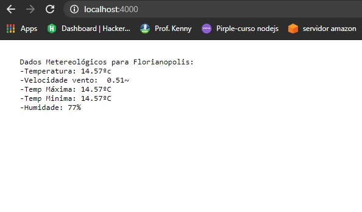

# api-integration-weather-nodejs
API integration using weather data with node.js



1. Create account at address: https://openweathermap.org/
2. forke this project to your account
3. afte use in terminal: ```git clone https://github.com/wellpinho/api-integration-weather-nodejs.git```
4. ```cd api-integration-weather-nodejs```
5. install the package request: ``npm i``
6. rename .env-example for .env and insert your api key on your account **openweathermap**
7. run ```npm run dev```
8. access url: http://localhost:4000

## Author: Wellington Pinho
connect with comig on LinkedIn: https://www.linkedin.com/in/wellpinho/
